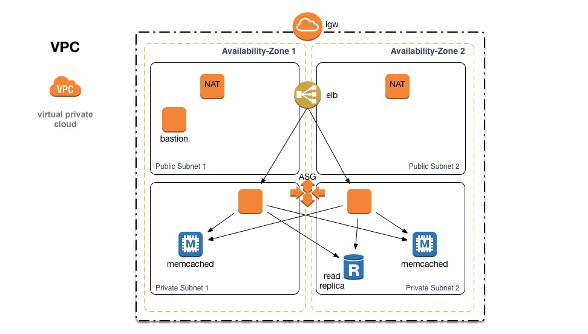

# mock-aws-env
Infrastructure as Code - Builds an entire AWS environment with Templates

## The Build Process

The AWS architecture is managed using CloudFormation templates.

The diagram below outlines the process to build the entire architecture from the ground up.

1. User starts the build by launching the **wrapper** stack via the AWS console or an API call.
2. The wrapper template launches the **vpc** stack and builds the VPC infrastructure.
3. Once the VPC build has completed, wrapper calls the **security** template to deploy the security groups.
4. After the security stack is completed, all the dependencies required to build the rest of the services are in place.  The **elb, cache, rds-replica and bastion** templates are launched.
5. After successful completion, 6 CloudFormation stacks (including the wrapper stack) are created.

## The Topology

Each VPC contains the following resources.

* Two availability zones to provide local redundancy
* Two NAT servers for outbound initiated traffic
* Two servers in an Autoscale group attached to a Load Balancer (ELB)
* Two ElastiCache nodes
* One read-replica Db node (The master should be located in another region.)
* One bastion host for remote access and management

## CloudFormation Templates

Template | Purpose
-------- | --------
bastion-template.json	| Launches a Bastion host into the public subnet in availability-zone 1
cache-template.json	| Launches the Cache node cluster
elb-template.json	| Deploys a Load Balancer and Autoscale group
rds-master-template.json	| Creates the master mySQL database (Note: Not launched by the wrapper template)
rds-replica-template.json	| Creates a mySQL read-replica node
security-template.json	| Creates all the needed security groups for each service
vpc-template.json	| Creates the VPC and all it's resources
wrapper-template.json	| Used to build the entire site from scratch

Regions currently supported:

* N. Virginia (us-east-1)
* Oregon (us-west-2)
* Ireland (eu-west-1)
* Tokyo (ap-northeast-1)

Note: Update template "Mappings" to add more regions.

